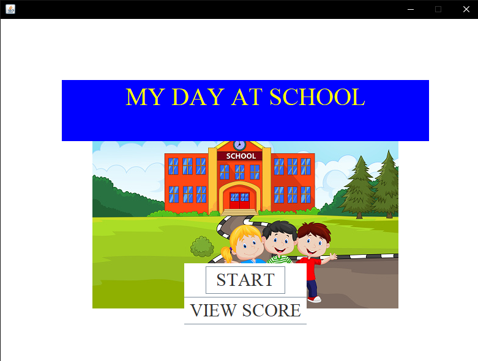

A text adventure game with sound and scoreboard using Java Swing for elementary students. Users need to choose correct answers based on the questions before they lose all their HP. The game includes a cheerful opening and different sound effects for choosing right and wrong answers. The top 5 players’ scores will be saved and can be viewed on the starting page.
